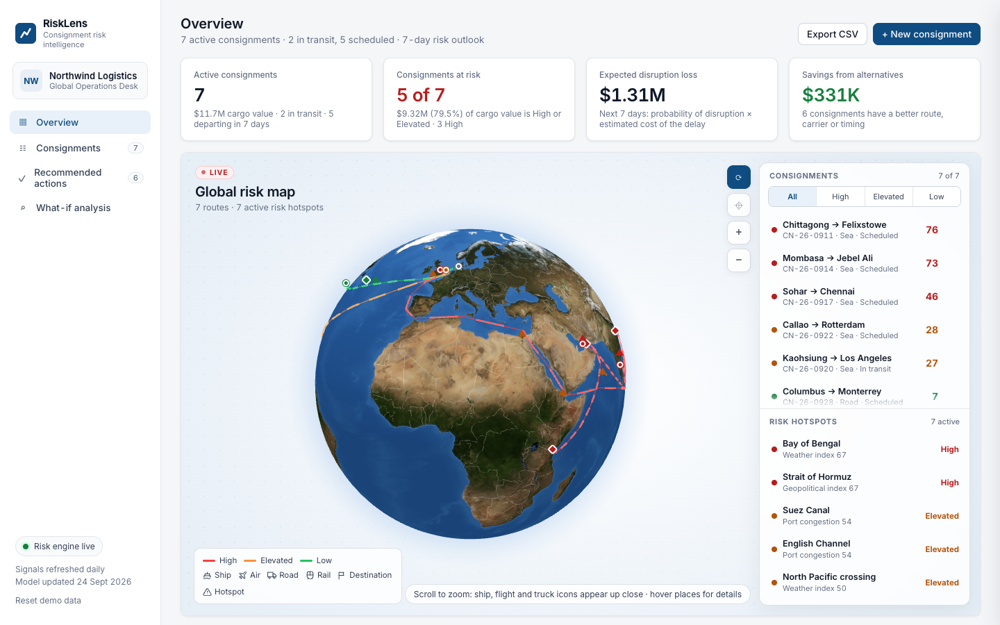
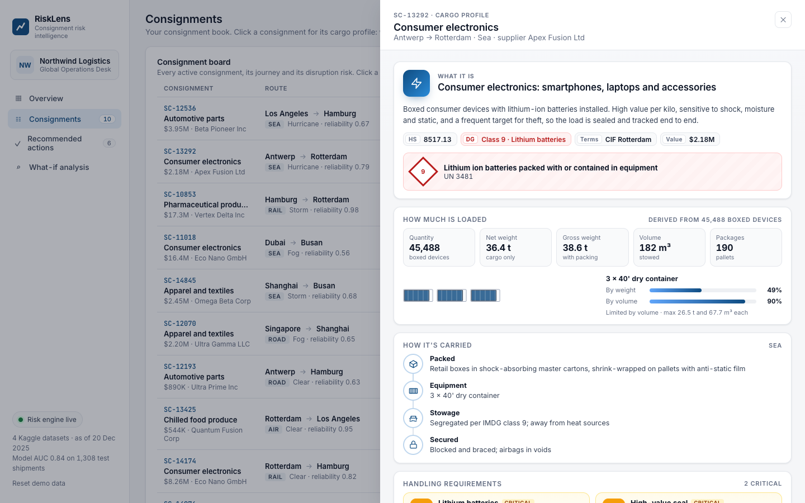
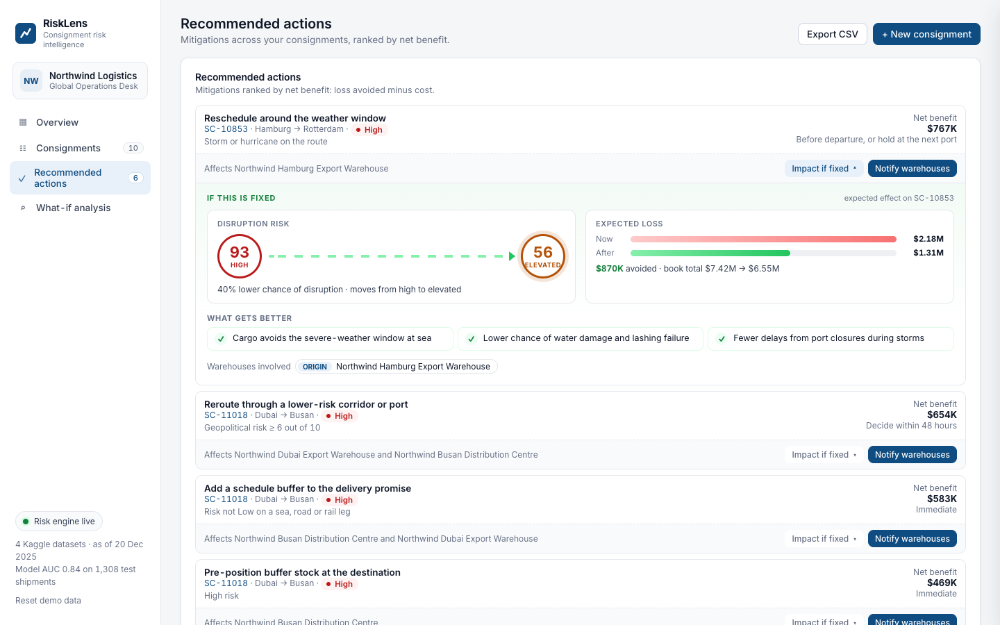
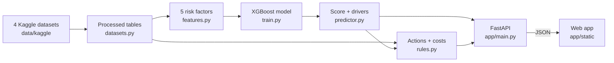

<div align="center">

# RiskLens

**Consignment risk intelligence for logistics teams.**
Predict which shipments will be disrupted, see why, and act before it happens.

[](https://www.python.org/)
[](https://fastapi.tiangolo.com/)
[](https://xgboost.readthedocs.io/)
[](#data)
[](https://vercel.com/new/clone?repository-url=https%3A%2F%2Fgithub.com%2Fshreya-anandhun%2Frisklens)
[](LICENSE)

**[Live demo](https://risklens-risklens1.vercel.app)** · [Features](#features) · [Data](#data) · [How it works](#how-it-works) · [Getting started](#getting-started) · [API](#api-reference)



</div>

## About

Supply-chain disruptions rarely come out of nowhere. Severe weather on the route, rising tension around a port, or a carrier that keeps running late are all visible in advance. These signals live in different places, though, and nobody adds them up for each shipment until it is too late.

RiskLens adds them up. For every active consignment, it:

1. **Predicts** the probability that the shipment is disrupted, with a gradient-boosted model trained on the dataset's 5,000 shipments.
2. **Explains** the score by showing how much each risk factor contributed to it.
3. **Recommends** costed actions, such as rerouting, rescheduling or switching carrier, ranked by the money they save.
4. **Notifies** the affected warehouses with a ready-to-send message.
5. **Deploys** the action through an agent workflow: it answers the warehouse's questions, gets the stakeholder's sign-off and applies the fix.

Everything in the portal is built from **four public Kaggle datasets**: shipments with a disruption label, the Geopolitical Risk (GPR) index, DataCo's order history and supplier master data. The operator, Northwind Logistics, is a fictional company. Its consignment book is ten real December 2025 shipments from the shipment dataset. Built for **Datathon 2K26** (BDA & CC track).

## Features

| Page | What it does |
|---|---|
| **Overview** | Headline numbers for the consignment book, and an interactive 3D globe with every route coloured by risk. Sea routes follow real shipping lanes through Malacca, Suez, Hormuz and Panama. Hover a port or chokepoint for its situation and its real **GPR index** reading. Below the globe: the data sources, and recent real disruptions on the same lanes with whether the model warned about them. |
| **Consignments** | A board with each shipment's route, journey progress, lane risk trend and best alternative. Click any row for its **cargo profile**: commodity and HS code, dangerous-goods class, load and container fill from the shipment's real weight, packing, handling rules and documents. |
| **Recommended actions** | Mitigations ranked by net benefit, each with a rationale quoting the datasets. **Impact if fixed** shows risk and expected loss before and after. **Notify warehouses** drafts an editable message to the affected warehouses and logs it. |
| **Intelligent workflow** | An agent-to-agent exchange that ends in a deployed action. The RiskLens agent sends the warehouse notification, the warehouse system asks a questionnaire, and the agent answers every question from the consignment's data. It then mails the stakeholder a consolidated summary, reads the reply (decision, date, constraint) and deploys the action itself: applying the model-scored alternative, or recording the action and moving the ETA. The stakeholder's reply is simulated; the deployment is real. |
| **What-if analysis** | Score a planned shipment before it leaves, with the score updating as you type. Or drop in a CSV: the Kaggle shipment file uploads as-is, and when it includes the real outcomes, each prediction is checked against what happened. |

<table>
  <tr>
    <td></td>
    <td></td>
  </tr>
  <tr>
    <td align="center"><sub>Cargo profile</sub></td>
    <td align="center"><sub>Recommended actions</sub></td>
  </tr>
</table>

## Data

| Dataset | Size | Used for |
|---|---|---|
| [Global Supply Chain Risk & Logistics 2024–2026](https://www.kaggle.com/datasets/nudratabbas/global-supply-chain-risk-and-logistics-2024-2026) | 5,000 shipments, Jan 2024 – Dec 2025, 9 ports, 64 lanes | Model training and testing, the consignment book, lane history |
| [Geopolitical Risk (GPR) index](https://www.kaggle.com/datasets/princehobby/geopolitical-risk-datasets) | Daily to Aug 2024, monthly by country to Jul 2024 | Real geopolitical readings for the countries at each port and chokepoint, and a rule that flags readings far above average |
| [DataCo Smart Supply Chain](https://www.kaggle.com/datasets/shashwatwork/dataco-smart-supply-chain-for-big-data-analysis) | 180,519 order lines, 2015–2018 | On-time benchmarks quoted in the recommended actions |
| [Supply chain master data](https://www.kaggle.com/datasets/ayodejiibrahimlateef/supply-chain-datasets) | 100 suppliers, 2,000 purchase orders | Supplier on-time rates and the supplier-readiness rule |

The GPR index is Caldara and Iacoviello's measure of geopolitical tension from news coverage. It is real-world data, and it ends in mid-2024. The shipment dataset appears to be synthetic. It contains rail shipments from Singapore to Los Angeles, for example. It is used because it has a disruption label for every shipment, which public data rarely offers, and its labels follow a learnable pattern.

`tools/fetch_datasets.sh` downloads all four into `data/kaggle`, which git ignores because DataCo alone is 90 MB. `python -m risklens.pipeline` then builds the compact tables in `data/processed` that the app reads, which come to under 1 MB.

## Tech stack

| Layer | Technology | Used for |
|---|---|---|
| Language | Python 3.12 | Data preparation, model training and the API |
| Data | pandas, NumPy | Cleaning and joining the Kaggle datasets |
| Machine learning | XGBoost | Gradient-boosted trees predicting shipment disruption |
| Evaluation | scikit-learn | AUC, precision, recall and cross-validation (training only) |
| API | FastAPI, Uvicorn | JSON endpoints and serving the web app |
| Frontend | HTML, CSS, vanilla JavaScript | A single-page app with no build step |
| 3D globe | globe.gl, Three.js, WebGL | Routes, markers and fly-to animations |
| Geography | topojson-client, Natural Earth | Country borders on the globe |
| Testing | pytest, httpx | Feature, rule and API tests |
| Hosting | Vercel, Docker | Serverless deployment, or any container host |

All frontend libraries are stored in `app/static/vendor`, so the app runs without an internet connection.

## How it works



### Features

Each shipment's signals become risk factors between 0 (safe) and 1 (riskiest). The web app uses the same functions as training.

| Factor | From | Importance |
|---|---|---:|
| Weather conditions | `Weather_Condition`: Clear 10, Rain 35, Fog 45, Storm 75, Hurricane 95 | 78% |
| Geopolitical risk | `Geopolitical_Risk_Score` / 10 | 14% |
| Carrier reliability | 1 − `Carrier_Reliability_Score` | 4% |
| Fuel price | `Fuel_Price_Index` scaled over its 1.2–4.5 range | 2% |
| Route distance | `Distance_km` / 15,000 | 2% |

`Lead_Time_Days` is left out on purpose. Disrupted shipments have about three times the lead time of on-time ones, so the column records the actual transit time after the disruption. Using it would leak the answer into the model. Leaving it out does not lower the test score.

### Model

An XGBoost classifier predicts `Disruption_Occurred`. The split is by date, so the test set is always in the model's future:

- **Train** on January 2024 to June 2025, 3,692 shipments.
- **Tune** the alert threshold on April to June 2025, using a model that has not seen those months.
- **Test** on July to December 2025, 1,308 shipments the final model never saw.

Monotonic constraints make sure a worse input can never lower the risk. SHAP values split each score into per-factor contributions, which the app shows as the top risk drivers.

| Metric (July – December 2025 test set) | Value |
|---|---:|
| AUC-ROC | 0.84 |
| Average precision (baseline 0.61) | 0.90 |
| Recall at the alert threshold | 86% |
| Precision at the alert threshold | 75% |
| Brier score (baseline 0.24) | 0.16 |
| Five-fold cross-validated AUC | 0.82 ± 0.02 |

The dataset's disruption rate is 61%, so the risk bands sit higher than they would for rarer events: **Low** under 40, **Elevated** 40 to 70, **High** 70 and above.

### Actions and costs

- **Expected loss** is the disruption probability multiplied by an estimated delay cost. The delay comes from the data: disrupted sea shipments took about 14.5 days longer than on-time ones, rail 7.9, road 5.9 and air 0.6. Each delay day costs 1.2% of cargo value, plus a 4% handling impact.
- **Cargo value** is not in the data, so it is estimated from the shipment's real weight with a typical value per kilo for its category.
- **Recommended actions** come from eight rules. Examples are "storm or hurricane on the route", "GPR index at either port over 1.25× its average" and "supplier on-time rate below 80%". Each rationale quotes the relevant figures from the datasets.
- **Alternatives**, such as a top-decile carrier, waiting out the weather or a lower-risk corridor, change the model's inputs and are re-scored by the model itself.
- **Net benefit** is the expected loss avoided minus the extra cost.

## Getting started

### Prerequisites

- Python 3.10 or newer (3.12 recommended)
- macOS only: the OpenMP runtime for XGBoost, installed with `brew install libomp`

### Run locally

```bash
git clone https://github.com/shreya-anandhun/risklens.git
cd risklens
./run.sh
```

Then open http://localhost:8000. The processed data and trained model are committed, so the app runs straight away. `run.sh` creates a virtual environment, installs dependencies and starts the server.

To set it up by hand instead:

```bash
python3 -m venv .venv
source .venv/bin/activate
pip install -r requirements-dev.txt
uvicorn app.main:app --reload
```

### Rebuild the data and model from Kaggle

```bash
tools/fetch_datasets.sh
python -m risklens.pipeline
```

This downloads the four datasets, rebuilds `data/processed`, retrains the model and reselects the consignment book.

### Run the tests

```bash
python -m pytest -q
```

## Deployment

### Vercel

[](https://vercel.com/new/clone?repository-url=https%3A%2F%2Fgithub.com%2Fshreya-anandhun%2Frisklens)

Vercel detects the FastAPI app in `app/main.py` and deploys it as a single function, with no configuration needed.

- `requirements.txt` holds only the runtime dependencies and uses the CPU-only XGBoost build on Linux. This keeps the function around 260 MB, under Vercel's 500 MB limit.
- Training and test tools live in `requirements-dev.txt`, which Vercel does not install.
- The raw Kaggle files are excluded in `.vercelignore`. The app only needs `data/processed`.

Changes made in the app, such as edited consignments and sent notifications, are stored in the function's temporary storage. They reset when Vercel starts a new instance.

### Docker

```bash
docker build -t risklens .
docker run -p 8000:8000 risklens
```

## Project structure

```
risklens/
├── app/
│   ├── main.py              FastAPI app: API routes and web app serving
│   └── static/              index.html, app.js, styles.css, vendored libraries
├── risklens/
│   ├── config.py            Paths, feature definitions, risk bands, as-of date
│   ├── datasets.py          Loads the Kaggle datasets and builds data/processed
│   ├── features.py          The 5 risk factors
│   ├── train.py             XGBoost training and evaluation
│   ├── book.py              Picks the consignment book from December 2025 shipments
│   ├── predictor.py         Scoring, SHAP drivers, alternatives
│   ├── rules.py             Mitigation rules and cost model
│   ├── validation.py        Input and CSV validation
│   ├── store.py             Consignment book storage
│   ├── geo.py               Ports, sea-lane network and chokepoints for the globe
│   ├── cargo.py             Cargo profiles per product category
│   ├── notify.py            Warehouse notifications and impact estimates
│   ├── workflow.py          Agent-to-agent exchange that deploys an action
│   └── pipeline.py          Runs datasets → training → book
├── data/
│   ├── kaggle/              Raw downloads (git-ignored)
│   └── processed/           Compact tables the app reads
├── models/                  Trained model and metadata
├── tests/                   pytest suite
├── tools/                   fetch_datasets.sh and asset scripts
├── docs/images/             README screenshots
├── requirements.txt         Runtime dependencies
├── requirements-dev.txt     Training and test dependencies
└── run.sh                   One-command local start
```

## API reference

| Method | Endpoint | Description |
|---|---|---|
| `GET` | `/api/meta` | Company, risk factors, bands, model metrics and data sources |
| `GET` | `/api/overview` | Headline numbers, scored consignments, globe data, recent disruptions and top actions |
| `GET` `POST` | `/api/consignments` | List the scored book, or add a consignment |
| `GET` `PUT` `DELETE` | `/api/consignments/{id}` | Detail with alternatives and lane history, edit, or remove |
| `GET` | `/api/consignments/{id}/cargo` | Cargo profile |
| `POST` | `/api/consignments/{id}/apply/{alternative}` | Apply an alternative plan |
| `POST` | `/api/consignments/import` | Add a validated batch |
| `POST` | `/api/consignments/reset` | Restore the book |
| `GET` | `/api/actions/{id}/{action}/draft` | Recipients and message for a warehouse notification |
| `GET` `POST` | `/api/notifications` | Notification log, or send a notification |
| `GET` `POST` | `/api/workflows` | Workflow runs, or start one for a consignment and action |
| `GET` | `/api/workflows/{id}` | One run with its full transcript |
| `POST` | `/api/workflows/{id}/advance` | Reveal the next step; the last step deploys the action |
| `POST` | `/api/score` | Score one consignment |
| `POST` | `/api/score/csv` | Score a CSV file |
| `GET` | `/api/template.csv` | Five real test shipments in the Kaggle layout |
| `GET` | `/api/export.csv` | Export the scored book |

Interactive documentation is available at `/docs` while the server is running.

### CSV format

The Kaggle shipment file's own columns work as-is: `Shipment_ID`, `Origin_Port`, `Destination_Port`, `Transport_Mode`, `Product_Category`, `Distance_km`, `Weight_MT`, `Fuel_Price_Index`, `Geopolitical_Risk_Score`, `Weather_Condition` and `Carrier_Reliability_Score`. An ID, carrier reliability, geopolitical risk and weather are required. If the file includes `Disruption_Occurred`, the response reports how often the model agreed with the real outcome. Column names are matched loosely, so `From`, `To` and `Weather` also work.

## Limitations

- **The shipment data appears synthetic.** The model's strong test score shows that it learns the dataset's pattern and generalises to later months. It does not prove accuracy on real-world shipments.
- **The GPR index ends in mid-2024**, while the shipments run to the end of 2025. The GPR readings give real geopolitical context. They are not a live feed.
- **Cargo value is estimated** from weight with a typical value per kilo for each category.
- **Estimated action effects.** Rule-based risk reductions are planning estimates. Alternatives are re-scored by the model.
- **Demo integrations.** Sensor readings and document statuses are sample values, since none of the datasets record them. Warehouse contacts use the reserved `example.com` domain, and notifications are logged, not emailed.
- **Scripted agents.** The workflow's questions, answers and the stakeholder's reply are generated from the data rather than by a language model, so the exchange is deterministic and runs offline. The deployment it ends in is a real change to the consignment.

## Acknowledgements

- The Kaggle dataset publishers: nudratabbas, princehobby, shashwatwork and ayodejiibrahimlateef
- Dario Caldara and Matteo Iacoviello for the [Geopolitical Risk index](https://www.matteoiacoviello.com/gpr.htm)
- [globe.gl](https://github.com/vasturiano/globe.gl) and [Three.js](https://threejs.org/) for the 3D globe
- [Natural Earth](https://www.naturalearthdata.com/) via [world-atlas](https://github.com/topojson/world-atlas) for country shapes
- NASA Blue Marble imagery for the Earth texture

## License

Released under the [MIT License](LICENSE). The datasets remain under their own licenses on Kaggle.
