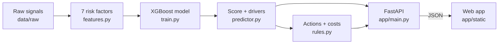

<div align="center">

# RiskLens

**Consignment risk intelligence for logistics teams.**
Predict which shipments will be disrupted in the next 7 days, see why, and act before it happens.

[](https://www.python.org/)
[](https://fastapi.tiangolo.com/)
[](https://xgboost.readthedocs.io/)
[](https://vercel.com/new/clone?repository-url=https%3A%2F%2Fgithub.com%2Fshreya-anandhun%2Frisklens)
[](LICENSE)

**[Live demo](LIVE_URL)** · [Features](#features) · [Tech stack](#tech-stack) · [How it works](#how-it-works) · [Getting started](#getting-started) · [API](#api-reference)


</div>

## About

Supply-chain disruptions rarely come out of nowhere. A carrier that keeps running late, a congested port, a storm season or rising tension along a trade route are all visible in advance. These signals live in different places, though, and nobody adds them up for each shipment until it is too late.

RiskLens adds them up. For every active consignment, it:

1. **Predicts** the probability of a disruption in the next 7 days with a gradient-boosted model.
2. **Explains** the score by showing how much each risk factor contributed to it.
3. **Recommends** costed actions, such as rerouting, rebooking or buffer stock, ranked by the money they save.
4. **Notifies** the affected warehouses with a ready-to-send message.

The demo is set up for a fictional company, **Northwind Logistics**, managing seven consignments across seven regions. It was built for **Datathon 2K26** (BDA & CC track).

> [!NOTE]
> All data in this repository is synthetic. Real shipment-level disruption data is private, so the data generator produces realistic signals and disruptions for the model to learn from. See [Limitations](#limitations).

## Features

| Page | What it does |
|---|---|
| **Overview** | Headline numbers for the consignment book, and an interactive 3D globe with every route coloured by risk. Drag to rotate, zoom in to see ship, air, road and rail icons, and hover any port or chokepoint for its current situation. Risk hotspots such as the Strait of Hormuz are scored from the same signals as the shipments. |
| **Consignments** | A board with each shipment's route, journey progress, 30-day risk trend and best alternative. Click any row for its **cargo profile**: commodity and HS code, dangerous-goods class, load and container fill, packing and stowage, handling rules, sensor readings against safe limits, and document readiness. |
| **Recommended actions** | Mitigations ranked by net benefit. **Impact if fixed** shows risk and expected loss before and after. **Notify warehouses** drafts an editable message to the affected origin and destination warehouses and logs it. |
| **What-if analysis** | Score a planned shipment before it leaves. Change any input and the score updates live, or drop in a CSV to score a whole batch at once. |

<table>
  <tr>
    <td></td>
    <td></td>
  </tr>
  <tr>
    <td align="center"><sub>Cargo profile</sub></td>
    <td align="center"><sub>Recommended actions</sub></td>
  </tr>
</table>

## Tech stack

| Layer | Technology | Used for |
|---|---|---|
| Language | Python 3.12 | Data generation, model training and the API |
| Data | pandas, NumPy | Feature engineering and the daily training panel |
| Machine learning | XGBoost | Gradient-boosted trees predicting 7-day disruption |
| Evaluation | scikit-learn | AUC, precision, recall and cross-validation (training only) |
| API | FastAPI, Uvicorn | JSON endpoints and serving the web app |
| Frontend | HTML, CSS, vanilla JavaScript | A single-page app with no build step |
| 3D globe | globe.gl, Three.js, WebGL | Routes, markers and fly-to animations |
| Geography | topojson-client, Natural Earth | Country borders on the globe |
| Testing | pytest, httpx | Feature, rule and API tests |
| Hosting | Vercel, Docker | Serverless deployment, or any container host |

All frontend libraries are stored in `app/static/vendor`, so the app runs without an internet connection.

## How it works



### 1. Data

`risklens/generate_data.py` builds 48 historical trade lanes with daily signals from June to September 2026: geopolitical index, port congestion, weather and commodity prices. Signals drift smoothly day to day. Disruptions are drawn from a hidden risk process with per-lane randomness, so the model has a real but noisy pattern to learn. Each of the seven demo consignments travels on one of these lanes.

### 2. Features

Every raw signal becomes a risk factor between 0 (safe) and 1 (riskiest). The web app uses the same functions as training.

| Factor | Calculation | Importance |
|---|---|---:|
| Disruption recency | `exp(−days since last disruption / 30)` | 34% |
| Price volatility | 30-day commodity price swing, capped at 25% | 14% |
| Lead time exposure | Lead time scaled between 10 and 90 days | 13% |
| Weather risk | Weather index / 100 | 11% |
| Geopolitical risk | 70% geopolitical index + 30% port congestion | 10% |
| Carrier reliability | 1 − on-time delivery rate | 10% |
| Lead time variability | Spread of lead time relative to its average | 8% |

### 3. Model

An XGBoost classifier predicts whether a lane is disrupted within the next 7 days. Two design choices keep it honest and explainable:

- **Time-based split.** The model trains on 1 June to 25 August and is tested on 26 August to 16 September, so the test set is always in the model's future.
- **Monotonic constraints.** A worse input can never lower the risk score.

Each score is broken down with SHAP values into per-factor contributions, which the app shows as the top risk drivers.

| Metric (held-out future window) | Value |
|---|---:|
| AUC-ROC | 0.80 |
| Average precision (baseline 0.20) | 0.61 |
| Recall at the alert threshold | 71% |
| Precision at the alert threshold | 51% |
| Brier score | 0.11 |

Scores map to bands: **Low** under 12, **Elevated** 12 to 30, **High** 30 and above.

### 4. Actions and costs

- **Expected loss** is the disruption probability multiplied by an estimated delay cost: a delay of `0.3 × lead time + 5` days at 1.2% of cargo value per day, plus a 4% handling impact.
- **Recommended actions** come from eight rules, for example "geopolitical risk ≥ 0.60 → reroute". Each rule carries an estimated cost and risk reduction.
- **Alternatives** such as another port, carrier or sailing date are re-scored by the model itself.
- **Net benefit** is the expected loss avoided minus the extra cost.

## Getting started

### Prerequisites

- Python 3.10 or newer (3.12 recommended)
- macOS only: the OpenMP runtime for XGBoost, installed with `brew install libomp`

### Run locally

```bash
git clone https://github.com/shreya-anandhun/risklens.git
cd risklens
./run.sh
```

Then open http://localhost:8000. `run.sh` creates a virtual environment, installs dependencies, builds the data and model if they are missing, and starts the server.

To set it up by hand instead:

```bash
python3 -m venv .venv
source .venv/bin/activate
pip install -r requirements-dev.txt
uvicorn app.main:app --reload
```

### Rebuild the data and model

```bash
python -m risklens.pipeline
```

This regenerates `data/`, retrains the model and writes `models/risk_model.json` and `models/model_meta.json`.

### Run the tests

```bash
python -m pytest -q
```

## Deployment

### Vercel

[](https://vercel.com/new/clone?repository-url=https%3A%2F%2Fgithub.com%2Fshreya-anandhun%2Frisklens)

Vercel detects the FastAPI app in `app/main.py` and deploys it as a single function, with no configuration needed.

- `requirements.txt` holds only the runtime dependencies and uses the CPU-only XGBoost build on Linux. This keeps the function around 260 MB, under Vercel's 500 MB limit.
- Training and test tools live in `requirements-dev.txt`, which Vercel does not install.
- The Python version is set in `.python-version`.

Changes made in the app, such as edited consignments and sent notifications, are stored in the function's temporary storage. They reset when Vercel starts a new instance, which returns the demo to its original state.

### Docker

```bash
docker build -t risklens .
docker run -p 8000:8000 risklens
```

## Project structure

```
risklens/
├── app/
│   ├── main.py              FastAPI app: API routes and web app serving
│   └── static/              index.html, app.js, styles.css, vendored libraries
├── risklens/
│   ├── config.py            Paths, feature definitions, risk bands
│   ├── generate_data.py     Synthetic lanes, signals, disruptions, consignments
│   ├── features.py          The 7 risk factors
│   ├── train.py             XGBoost training and evaluation
│   ├── predictor.py         Scoring, SHAP drivers, alternatives
│   ├── rules.py             Mitigation rules and cost model
│   ├── validation.py        Input and CSV validation
│   ├── store.py             Consignment book storage
│   ├── geo.py               Ports, sea lanes and hotspots for the globe
│   ├── cargo.py             Cargo profiles
│   ├── notify.py            Warehouse notifications and impact estimates
│   └── pipeline.py          Runs data → features → training
├── data/                    raw/ and processed/ CSVs
├── models/                  Trained model and metadata
├── tests/                   pytest suite
├── tools/                   One-off asset scripts
├── docs/images/             README screenshots
├── requirements.txt         Runtime dependencies
├── requirements-dev.txt     Training and test dependencies
└── run.sh                   One-command local start
```

## API reference

| Method | Endpoint | Description |
|---|---|---|
| `GET` | `/api/meta` | Company, risk factor definitions and risk bands |
| `GET` | `/api/overview` | Headline numbers, scored consignments, globe data and top actions |
| `GET` `POST` | `/api/consignments` | List the scored book, or add a consignment |
| `GET` `PUT` `DELETE` | `/api/consignments/{id}` | Detail with alternatives and history, edit, or remove |
| `GET` | `/api/consignments/{id}/cargo` | Cargo profile |
| `POST` | `/api/consignments/{id}/apply/{alternative}` | Apply an alternative plan |
| `POST` | `/api/consignments/import` | Add a validated batch |
| `POST` | `/api/consignments/reset` | Restore the demo book |
| `GET` | `/api/actions/{id}/{action}/draft` | Recipients and message for a warehouse notification |
| `GET` `POST` | `/api/notifications` | Notification log, or send a notification |
| `POST` | `/api/score` | Score one consignment |
| `POST` | `/api/score/csv` | Score a CSV file |
| `GET` | `/api/template.csv` | CSV template |
| `GET` | `/api/export.csv` | Export the scored book |

Interactive documentation is available at `/docs` while the server is running.

### CSV format

Required columns: an ID (`consignment_id` or `supplier_name`), `lead_time_days`, `reliability_score`, `geopolitical_risk_index` and `weather_risk_level`. Optional columns such as route, dates, units, port congestion and price swing improve the score. Column names are matched loosely, so `Shipment ID`, `From`, `To` and `ETA` all work. Download a template from the What-if page or `/api/template.csv`.

## Limitations

- **Synthetic data.** The model learns a pattern the generator created, so its metrics show that the pipeline works, not real-world accuracy. Plugging in real feeds, such as vessel tracking, weather forecasts and news-based risk indices, only changes the input files.
- **Lane-level model.** Consignments inherit the history of the lane they travel on.
- **Estimated action effects.** Rule-based risk reductions are assumptions. Alternatives are re-scored by the model.
- **Demo integrations.** Cargo sensors, warehouse contacts and documents are sample content. Notifications are logged, not emailed, and use the reserved `example.com` domain.

## Acknowledgements

- [globe.gl](https://github.com/vasturiano/globe.gl) and [Three.js](https://threejs.org/) for the 3D globe
- [Natural Earth](https://www.naturalearthdata.com/) via [world-atlas](https://github.com/topojson/world-atlas) for country shapes
- NASA Blue Marble imagery for the Earth texture

## License

Released under the [MIT License](LICENSE).
